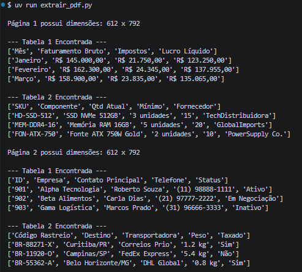
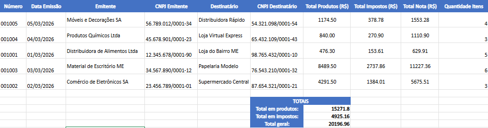
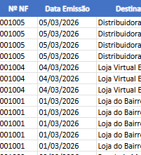

# PDF Automation & Data Extraction Suite (RPA)

[](https://www.python.org/)
[](https://www.reportlab.com/)
[](https://github.com/jsvine/pdfplumber)
[](LICENSE)


## Visão Geral do Projeto

Uma **solução end-to-end de Automação de Processos Robóticos (RPA)** focada no processamento, extração e geração de documentos corporativos em PDF. 

Ciclo completo de tratamento de documentos não estruturados e semiestruturados (como relatórios de faturamento, controle de estoque e notas fiscais), englobando desde a **criação dinâmica de PDFs complexos** até a **extração automatizada de dados tabulares e imagens** para integração com relatórios analíticos (Excel).


## Problema de Negócio & Aplicação

Nas empresas, grandes volumes de dados cruciais permanecem "presos" em arquivos PDF (extratos, relatórios fiscais, ordens de compra). Este repositório demonstra como otimizar o fluxo operacional através de scripts automatizados em Python, reduzindo o trabalho manual, minimizando erros operacionais e acelera a extração de dados para relatórios gerenciais.


## Funcionalidades e Estrutura dos Códigos

A pasta está organizada nos seguintes scripts:

| Arquivo | Descrição / Responsabilidade Técnica |
| :--- | :--- |
| **`gerar_pdf.py`** | **Geração Sintética de Documentos:** Utiliza a biblioteca `ReportLab` para construir relatórios financeiros e operacionais complexos, com estilos customizados, tabelas zebradas, quebras de página e formatação profissional. |
| **`extrair_pdf.py`** | **Parsing de Tabelas & Layout:** Realiza a leitura estruturada das páginas do PDF através da `pdfplumber`, extraindo dados tabulares mantendo as relações entre colunas e linhas. |
| **`main.py`** | **Processamento Multimídia & Busca:** Inspeciona metadados (dimensões de página), extrai stream de imagens utilizando `Pillow` e `matplotlib`, e executa algoritmos de busca de padrões textuais por palavra-chave. |
| **`extrair_dados_notas_foscais.py`** | **Pipeline de Dados Fiscais:** Focado no parsing e estruturação de dados de documentos fiscais/faturamento para exportação analítica. |

## Estrutura do Repositório

```text
1_extrator_pdf/
│
├── documento_treinamento_rpa.pdf   # Documento PDF base gerado dinamicamente
├── exemplo_aula.pdf                # PDF de teste/amostra
├── gerar_pdf.py                    # Script de criação automatizada de PDFs corporativos
├── extrair_pdf.py                  # Extrator de tabelas e metadados
├── main.py                         # Motor de extração de imagens, buscas e inspeção
├── extrair_dados_notas_foscais.py  # Pipeline direcionado a notas/relatórios fiscais
├── relatorio_notas_fiscais.xlsx    # Saída estruturada dos dados processados (Excel)
└── README.md                       # Documentação do projeto

```

---

## Tecnologias e Bibliotecas Utilizadas

* **[Python](https://www.python.org/):** Linguagem core para desenvolvimento dos scripts de RPA.
* **[pdfplumber](https://github.com/jsvine/pdfplumber):** Extração precisa de texto, metadados e estruturas tabulares de PDFs.
* **[ReportLab](https://www.reportlab.com/):** Criação programática e estilização avançada de documentos PDF.
* **[Pillow (PIL)](https://python-pillow.org/) & [Matplotlib](https://matplotlib.org/):** Manipulação, tratamento e visualização gráfica de fluxos de imagens extraídos dos documentos.
* **[OpenPyXL / Pandas](https://pandas.pydata.org/):** Estruturação e consolidação dos dados para exportação no formato Excel (`.xlsx`).

## Como Executar o Projeto

### Pré-requisitos

Certifique-se de ter o Python 3.8+ instalado em sua máquina.

### 1. Clonar o Repositório

```bash
git clone [https://github.com/area-41/RPA.git](https://github.com/area-41/RPA.git)
cd RPA/1_extrator_pdf

```

### 2. Instalar Dependências ou UV

```bash
pip install pdfplumber reportlab pillow matplotlib openpyxl

# ou utilizando UV:

uv init

uv add pdfplumber reportlab pillow matplotlib openpyxl

```

### 3. Execução dos Scripts

1. **Gerar o PDF de testes:**
```bash
python gerar_pdf.py

# ou utilizando UV:

uv run gerar_pdf.py

```


*Irá gerar o arquivo `documento_treinamento_rpa.pdf` com dados fictícios de faturamento, estoque e logística.*
2. **Extrair tabelas do PDF:**
```bash
python extrair_pdf.py

# ou utilizando UV:

uv run extrair_pdf.py

```


3. **Inspecionar imagens e buscar termos específicos:**
```bash
python main.py

# ou utilizando UV:

uv run main.py

```


## Extraindo informação do pdf

usando "extrair_pdf.py"




## Arquivo xlsx gerado

usando "extrair_dados_notas_fiscais.py"





## Próximos Passos & Melhorias Futuras

#### Implementação de **OCR (Tesseract)** para suporte a PDFs digitalizados/scaneados sem camada de texto.

